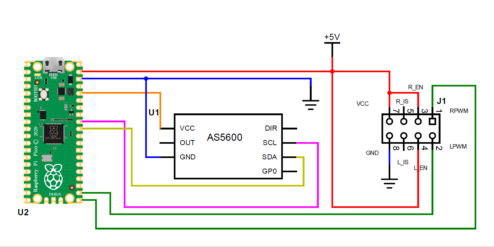

DIY electric winch handle
===

Components:
---

* RPi Pico
* AS5600 as a joystick sensor
* IBT_2 (BTS7960) motor driver

Connection diagram
---

Logging and settings
---
The device exposes two virtual UART ports. One for logging and one for shell.
Shell commands allow you to adjust parameters and save them permanently.

Essential shell commands:
---

* `bootloader` Reboot MCU to bootloader
* `help` Prints the help message.
* `joystick` Prints joystick position. Optionally, you can specify the number of samples to take.
* `params` Print current params
* `pause`  Suspends normal motor operations to set up parameters
* `reboot` Reboots the device
* `resume` Resumes normal motor operation
* `set center` Sets joystick central(neutral) position [0..359]
* `set pwm_min` Sets minimal pwm [0..99]
* `set dead_angle` Sets joystick dead angle [0..180]
* `set max_angle` Sets joystick max angle [0..180]